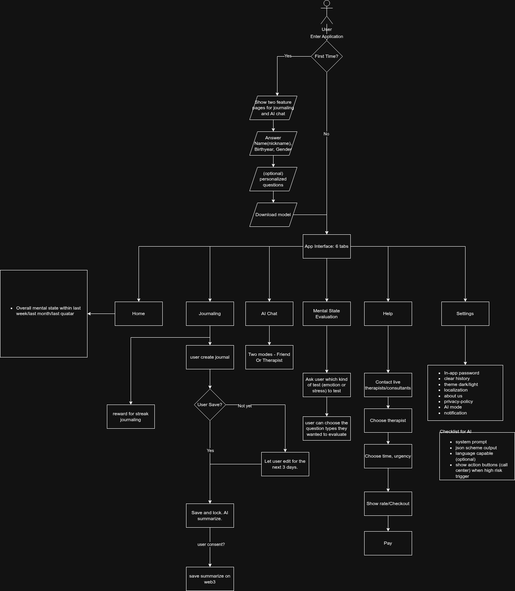

# Anchor – Your mind's safest place to land

> 🤖 **Built for the Gemini 3 Global Hackathon** — Powered by Google's most capable AI

**Anchor** is a decentralized mental health companion that combines **Gemini 3's advanced reasoning** with blockchain technology to deliver clinical-grade mental health support. By leveraging **EthStorage** and offering both on-device AI and **Gemini 3 cloud intelligence**, Anchor ensures that sensitive clinical assessments and personal journals remain under the user's sole control while providing deep, empathetic insights powered by cutting-edge AI.



---

## 📑 Table of Contents

- [Introduction](#-introduction)
- [Gemini 3 Integration](#-gemini-3-integration)
- [Architecture](#-architecture)
- [Key Features](#-key-features)
- [Tech Stack](#-tech-stack)
- [Build Instructions](#-build-instructions)
- [Configuration](#%EF%B8%8F-configuration)
- [Demo](#-demo)
- [Links](#-links)

---

## 🎯 Introduction

> **⚠️ This is NOT just another chat interface.** Anchor is a comprehensive mental health ecosystem that combines AI reasoning, clinical assessments, blockchain anchoring, and gamified behavior change into one integrated platform.

Mental health data is incredibly sensitive. Traditional apps store your deepest thoughts on corporate servers—vulnerable to breaches, profiling, and misuse. **Anchor** flips this paradigm:

- **🔐 Privacy-First AI** — Choose between on-device AI (ExecuTorch/Llama 3.2) or cloud AI (Gemini 3)
- **⛓️ Immutable Records** — Journal summaries stored on EthStorage (decentralized & permanent)
- **🏆 NFT Rewards** — Earn streak milestone NFTs (ERC-721) for consistent journaling
- **🏥 Clinical Assessments** — Validated GAD-7 (anxiety) & PHQ-9 (depression) screenings
- **🌍 Multi-language** — Supports 8 languages: English, German, Spanish, French, Hindi, Italian, Portuguese, Thai

### What Makes Anchor Different?

**Most AI apps**: Chat interface + GPT wrapper  
**Anchor**: Integrated mental health platform with 5 core modules:

1. **📝 Journaling System** → Guided prompts, AI analysis, blockchain anchoring
2. **🧠 Clinical Assessments** → Standardized GAD-7 & PHQ-9 screenings with scoring
3. **🤖 AI Companion** → Gemini 3-powered conversational support (not just chat!)
4. **🏆 Gamification** → NFT rewards for behavior change and streak maintenance
5. **⛓️ Blockchain Layer** → Permanent, censorship-resistant data anchoring

---

## 🤖 Gemini 3 Integration

**Anchor leverages Gemini 3's cutting-edge capabilities to deliver clinical-grade mental health support that was previously impossible with traditional AI models.**

### Why Gemini 3?

Mental health analysis requires nuanced understanding of human emotions, context, and clinical psychology. Gemini 3's advanced reasoning and multimodal intelligence make it uniquely suited for this challenge.

### Core Gemini 3 Features We Use

#### 🧠 **Advanced Reasoning & Deep Understanding**

- **Emotional Pattern Recognition**: Gemini 3 analyzes journal entries to detect subtle emotional patterns, identifying anxiety, depression, and stress indicators that simpler models miss
- **Clinical-Grade Assessments**: Processes GAD-7 and PHQ-9 responses with medical-grade accuracy, providing severity scoring aligned with clinical guidelines
- **Risk Assessment**: Uses advanced reasoning to identify crisis indicators and suicidal ideation with appropriate sensitivity and urgency
- **Contextual Memory**: Understands conversation history to provide personalized, evolving mental health support

#### 🎯 **Multimodal Intelligence**

- **Text Analysis**: Deep comprehension of complex emotional language, metaphors, and implicit meaning in journal entries
- **Structured Data Processing**: Interprets clinical assessment scores alongside free-text responses for comprehensive analysis
- **Cross-Modal Insights**: Combines quantitative metrics (PHQ-9 scores) with qualitative data (journal text) for holistic mental health evaluation

#### ⚡ **Low Latency & Real-Time Support**

- **Immediate Crisis Response**: When users need support, Gemini 3's low latency ensures they get help in seconds, not minutes
- **Responsive Conversations**: Natural, flowing dialogue in the AI companion chat without frustrating delays
- **Instant Analysis**: Journal summaries and insights generated in real-time, keeping users engaged in their mental health journey

### Gemini 3 in Action

**Journal Analysis Pipeline:**

```
User's Journal Entry
        ↓
  Gemini 3 Processes:
  • Emotional tone detection
  • Key themes extraction
  • Risk level assessment
  • Action items generation
        ↓
Clinical-Grade Output:
  • Summary of entry
  • Emotional state classification
  • Personalized coping suggestions
  • Crisis resources (if needed)
```

**Assessment Analysis:**

```
GAD-7 / PHQ-9 Responses
        ↓
  Gemini 3 Analyzes:
  • Clinical severity scoring
  • Symptom pattern identification
  • Correlation with journal history
  • Trend analysis over time
        ↓
Actionable Insights:
  • Severity level (Minimal/Mild/Moderate/Severe)
  • Personalized recommendations
  • Professional help suggestions
  • Tracking progress over time
```

### Why This Matters

Traditional mental health apps either:

1. Use simple keyword matching (inaccurate and potentially dangerous)
2. Store sensitive data on corporate servers (privacy nightmare)
3. Require expensive human therapists (not accessible to everyone)

**Anchor + Gemini 3 solves all three:**

✅ **Clinical accuracy** through advanced AI reasoning  
✅ **User privacy** through optional on-device processing + blockchain anchoring  
✅ **24/7 accessibility** without the cost of traditional therapy

### Technical Implementation

- **Service Integration**: [`gemini_service.dart`](lib/services/gemini_service.dart) - Direct Gemini 3 API integration
- **Hybrid Architecture**: Users choose between on-device Llama 3.2 or cloud Gemini 3
- **Privacy Controls**: Gemini 3 processes conversations only when user explicitly opts for cloud AI
- **Structured Prompts**: Carefully engineered prompts ensure clinically appropriate, empathetic responses

**This is not just another chat interface.** Anchor uses Gemini 3 to save lives through intelligent, accessible, private mental health support.

---

## 🏗 Architecture

```
┌──────────────────────────────────────────────────────────────────┐
│                          ANCHOR APP                              │
│                    (Flutter Cross-Platform)                      │
├──────────────────────────────────────────────────────────────────┤
│                                                                  │
│  ┌─────────────────┐  ┌─────────────────┐  ┌─────────────────┐  │
│  │   Journaling    │  │  Mental Health  │  │    AI Chat      │  │
│  │     Module      │  │   Assessments   │  │    Companion    │  │
│  │                 │  │  (GAD-7/PHQ-9)  │  │                 │  │
│  └────────┬────────┘  └────────┬────────┘  └────────┬────────┘  │
│           │                    │                    │           │
│           ▼                    ▼                    ▼           │
│  ┌─────────────────────────────────────────────────────────────┐│
│  │                      AI PROCESSING LAYER                    ││
│  │         Llama 3.2 1B (On-Device) / Gemini 3 (Cloud)         ││
│  │            🔒 On-Device or 🌐 Cloud Options                 ││
│  └─────────────────────────────────────────────────────────────┘│
│                                                                  │
│  ┌─────────────────────────────────────────────────────────────┐│
│  │                      LOCAL STORAGE                          ││
│  │                   SQLite + Secure Storage                   ││
│  └─────────────────────────────────────────────────────────────┘│
│                                                                  │
└──────────────────────────────────────────────────────────────────┘
                              │
                              ▼
┌──────────────────────────────────────────────────────────────────┐
│                     BLOCKCHAIN LAYER                             │
├──────────────────────────────────────────────────────────────────┤
│                                                                  │
│  ┌─────────────────┐  ┌─────────────────┐  ┌─────────────────┐  │
│  │    EthStorage   │  │  NFT Contract   │  │    MetaMask     │  │
│  │   (Data Layer)  │  │   (ERC-721)     │  │   (Wallet)      │  │
│  │                 │  │                 │  │                 │  │
│  │  Permanent      │  │  Streak Reward  │  │  Reown AppKit   │  │
│  │  Journal Store  │  │  Milestones     │  │  WalletConnect  │  │
│  └─────────────────┘  └─────────────────┘  └─────────────────┘  │
│                                                                  │
│              Sepolia Testnet (Chain ID: 11155111)                │
└──────────────────────────────────────────────────────────────────┘
```

### Data Flow

1. **User writes journal entry** → Processed entirely on-device or with Gemini 3
2. **AI generates insights** → Summary, emotion analysis, action items, risk assessment
3. **User opts to anchor** → Summary (not raw content) stored on EthStorage blockchain
4. **Streak milestones** → Mint commemorative NFTs to connected wallet
5. **Clinical assessments** → GAD-7/PHQ-9 scored and tracked over time
6. **AI companion** → Ongoing conversational support using Gemini 3's reasoning

### Beyond Chat: A Complete Mental Health Ecosystem

Unlike simple chatbot wrappers, Anchor integrates multiple technologies:

- **Clinical Psychology** → Validated assessment instruments (GAD-7, PHQ-9)
- **Behavioral Science** → NFT gamification for habit formation
- **Blockchain** → Immutable journaling via EthStorage
- **Cryptography** → Wallet-based authentication, on-chain verification
- **AI/ML** → Gemini 3 for reasoning + on-device ExecuTorch models
- **Cross-platform** → Flutter app running on 6+ platforms

---

## ✨ Key Features

### 📓 Private Journaling

- Guided journal prompts
- AI-generated summaries and insights
- Local SQLite storage with secure encryption
- Optional blockchain anchoring of summaries

### 🧠 On-Device AI Assistant

- **Llama 3.2 1B** — Compact model (~1.1GB) for most devices
- **Llama 3.2 3B** — Advanced model (~2.6GB) for devices with 6GB+ RAM
- Runs via ExecuTorch — completely offline, no API calls

### 🏥 Clinical Assessments

| Assessment | Purpose                                | Questions |
| ---------- | -------------------------------------- | --------- |
| **GAD-7**  | Generalized Anxiety Disorder screening | 7         |
| **PHQ-9**  | Depression screening                   | 9         |

Results are scored per clinical guidelines with severity levels and recommendations.

### 🎖️ NFT Streak Rewards

Earn commemorative NFTs for journaling consistency:

| Milestone           | Streak   | Rarity    |
| ------------------- | -------- | --------- |
| 🌱 First Step       | 1 day    | Starter   |
| 🥉 Week Warrior     | 7 days   | Common    |
| 🥈 Monthly Master   | 30 days  | Rare      |
| 🥇 Century Champion | 100 days | Epic      |
| 🏆 Year Legend      | 365 days | Legendary |

### ⛓️ EthStorage Integration

- Permanent, censorship-resistant storage
- Only AI-generated summaries stored (not raw journals)
- Verifiable on-chain with transaction explorer

### 🔐 Security

- Biometric app lock (Face ID / Touch ID)
- PIN/password authentication
- Encrypted local storage

---

## 🛠 Tech Stack

| Layer              | Technology                               |
| ------------------ | ---------------------------------------- |
| **Frontend**       | Flutter 3.10+ (Dart)                     |
| **On-Device AI**   | ExecuTorch, Llama 3.2                    |
| **Local Database** | SQLite, Secure Storage                   |
| **Blockchain**     | Ethereum (Sepolia Testnet)               |
| **Storage**        | EthStorage (Decentralized)               |
| **Wallet**         | Reown AppKit (WalletConnect), MetaMask   |
| **NFT Standard**   | ERC-721                                  |
| **Platforms**      | Android, iOS, Web, macOS, Windows, Linux |

---

## 🚀 Build Instructions

### Prerequisites

- **Flutter SDK** 3.10+ → [Install Flutter](https://docs.flutter.dev/get-started/install)
- **MetaMask** (browser extension or mobile app)
- **Sepolia Test ETH** → [Get from faucet](https://sepoliafaucet.com)

### Step 1: Clone & Install

```bash
git clone https://github.com/w99910/anchor.git
cd anchor
flutter pub get
```

### Step 2: Configure Environment

Copy `.env.example` to `.env` and fill in your values:

```bash
cp .env.example .env
```

```env
REOWN_PROJECT_ID=
ALCHEMY_API_KEY=

# Recipient wallet address for payments
# For testing on Sepolia: use your own MetaMask address or a valid test address
# This is where crypto payments will be sent
RECIPIENT_WALLET=

GEMINI_API_KEY=  # Get from https://aistudio.google.com/apikey

# EthStorage Configuration
# Private key for signing transactions to EthStorage testnet
# WARNING: Use a dedicated testing wallet, never your main wallet!
# Get testnet ETH from: https://faucet.quarkchain.io/
ETHSTORAGE_PRIVATE_KEY=0xyour_private_key_here
```

### Step 3: Run the App

```bash
# Run on Android
flutter run -d android

# Run on iOS
flutter run -d ios

# Run on macOS
flutter run -d macos
```

> ⚠️ **Note:** This app has only been tested on **Android emulators**, **real Android devices** and **real iPhone 13**. Web, and other platforms are not yet tested and may have issues.

### Step 4: Download AI Model

On first launch, the app will prompt you to download the on-device AI model:

- **Compact (Llama 3.2 1B)** — ~1.1GB, works on most devices
- **Advanced (Llama 3.2 3B)** — ~2.6GB, requires 6GB+ RAM

---

## ⚙️ Configuration

The app reads configuration from environment variables (`.env` file). See [.env.example](.env.example) for all available options.

| Variable                 | Description                                                                      | Required                |
| ------------------------ | -------------------------------------------------------------------------------- | ----------------------- |
| `REOWN_PROJECT_ID`       | Reown (WalletConnect) Project ID from [cloud.reown.com](https://cloud.reown.com) | ✅                      |
| `ALCHEMY_API_KEY`        | Alchemy API key for RPC (improves performance)                                   | Optional                |
| `RECIPIENT_WALLET`       | Wallet address for receiving payments                                            | Optional                |
| `GEMINI_API_KEY`         | Google Gemini 3 API key for advanced cloud AI capabilities                       | Optional                |
| `ETHSTORAGE_PRIVATE_KEY` | Private key for EthStorage transactions                                          | For blockchain features |

### EthStorage Configuration

See [ETHSTORAGE_SETUP.md](ETHSTORAGE_SETUP.md) for detailed setup instructions.

### NFT Contract Deployment

See [NFT_DEPLOYMENT_GUIDE.md](NFT_DEPLOYMENT_GUIDE.md) for deploying your own streak NFT contract.

---

## 🎬 Demo

### Video Walkthrough

_Coming soon — Demo video showcasing the full user journey_

### Screenshots

|              Journaling               |          AI Chat          |         Assessments         |        NFT Rewards        |
| :-----------------------------------: | :-----------------------: | :-------------------------: | :-----------------------: |
| 📓 Create entries with guided prompts | 🤖 Chat with on-device AI | 🧠 GAD-7 & PHQ-9 screenings | 🏆 Mint streak milestones |

---

## 🔗 Links

| Resource                | Link                                                         |
| ----------------------- | ------------------------------------------------------------ |
| 📦 **Repository**       | [github.com/w99910/anchor](https://github.com/w99910/anchor) |
| 🌐 **Landing Page**     | [https://anchor.thomasbrillion.pro](#)                       |
| 📄 **EthStorage Docs**  | [docs.ethstorage.io](https://docs.ethstorage.io)             |
| 🦊 **MetaMask**         | [metamask.io](https://metamask.io)                           |
| 💧 **Sepolia Faucet**   | [sepoliafaucet.com](https://sepoliafaucet.com)               |
| 🔗 **Sepolia Explorer** | [sepolia.etherscan.io](https://sepolia.etherscan.io)         |

---

## 📂 Project Structure

```
anchor/
├── lib/
│   ├── main.dart              # App entry point
│   ├── config/                # Web3 & EthStorage configs
│   ├── l10n/                  # Localization (8 languages)
│   ├── pages/
│   │   ├── ai_chat_page.dart      # AI companion chat
│   │   ├── journaling/            # Journal creation & summary
│   │   ├── mental_state/          # GAD-7 & PHQ-9 assessments
│   │   ├── rewards_page.dart      # NFT streak rewards
│   │   └── settings_page.dart     # App settings
│   ├── services/
│   │   ├── llm_service.dart       # On-device AI inference
│   │   ├── ethstorage_service.dart # Blockchain storage
│   │   ├── nft_service.dart       # NFT minting
│   │   └── web3_service.dart      # Wallet connection
│   └── utils/                 # Helpers & utilities
├── android/                   # Android platform code
├── ios/                       # iOS platform code
├── web/                       # Web platform code
├── landing/                   # Marketing landing page
└── assets/                    # Images & models
```

---

## 🤝 Contributing

Contributions are welcome! Please feel free to submit a Pull Request.

---

## 📄 License

This project is licensed under the MIT License - see the [LICENSE](LICENSE) file for details.

---

<p align="center">
  <b>Built with ❤️ for mental health privacy</b><br>
  <i>Your thoughts. Your data. Your control.</i>
</p>